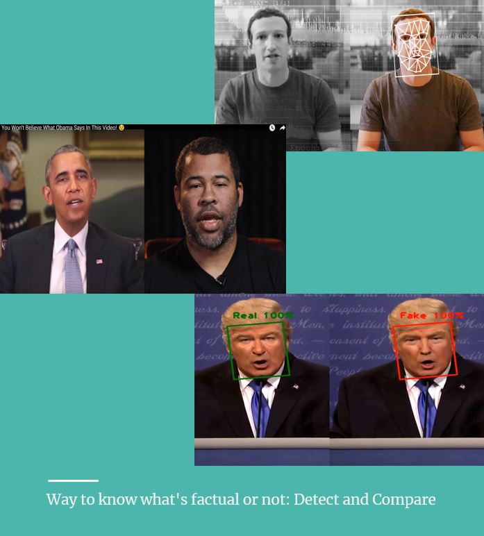
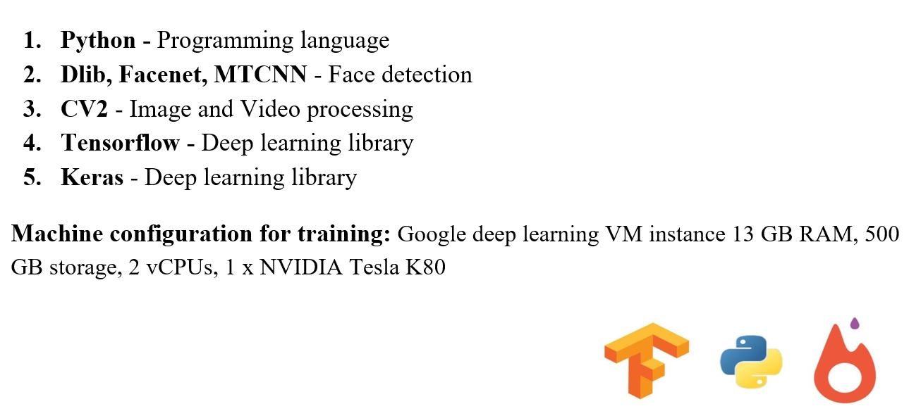
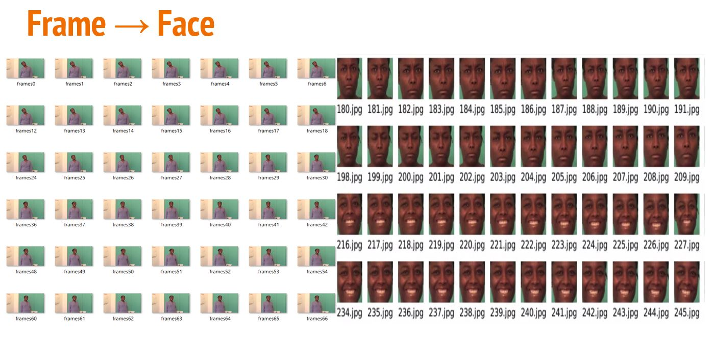
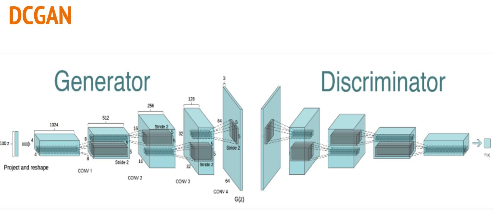
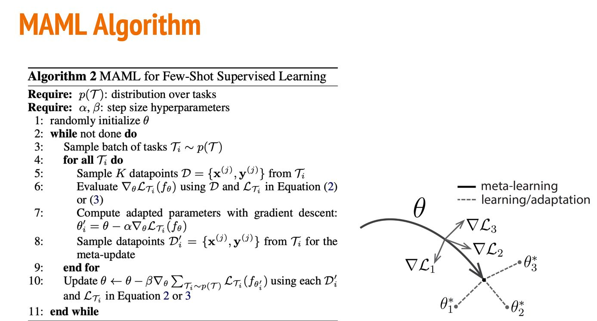
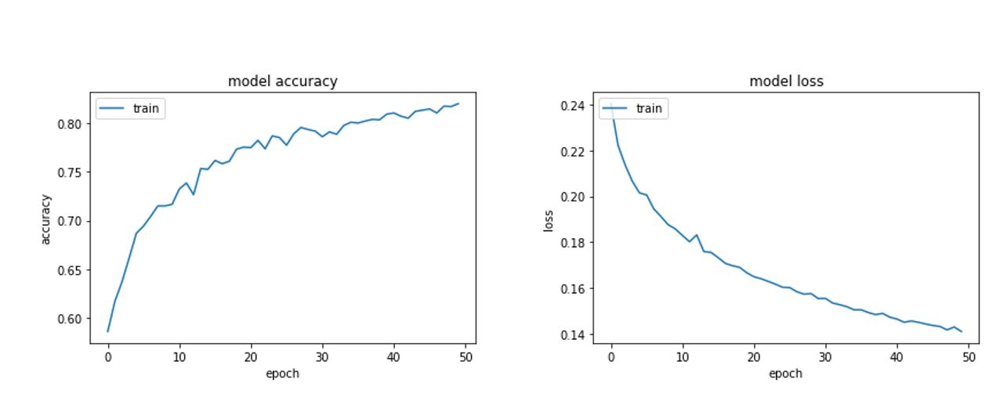

# Deep Fake Detection

Problem Statement and Background:
Deepfakes can distort our perception of the truth and we need to develop a strategy to improve their detection. Deep Fakes are increasingly detrimental to privacy, social security, and democracy. We plan to achieve better accuracy in predicting real and fake videos.

For an instance, Recently a video on social media has shown that a high ranked U.S legislator declared his own support for an enormous tax increase. At this point, people might tend to react accordingly because the video is exactly the same as the person by looks and voice. This way, DeepFake content can be used to manipulate people’s opinions. So, Deepfakes detection plays a prominent role in identifying fake content on social media and other forms of media.

## # Dataset:

We plan to use Detect fake videos using “DeepFake detection” challenge dataset of Kaggle.
Dataset: https://www.kaggle.com/c/deepfake-detection-challenge/data
The full dataset contains 470 GB of video files(training and testing) and a metadata file for each video. We plan to use 100 videos with ground truth, split them as 70% training, and 20% test and evaluate models using this. We plan to build a model that generalizes well.

Columns in metadata file:
filename - the filename of the video.
label - whether the video is real or fake.
original - in the case that a train set video is fake, the original video is listed here.
split - this is always equal to "train

## Preprocessing:
Videos to frames Conversion - Captured frames using Vedio_Capture class of cv2 library from a video.
Individual Video length (8 seconds) → 300 Frames

## Methods:

## Result:

## References:

    ●	Blink detection network using CNN and LSTM - https://arxiv.org/pdf/1806.02877.pdf
    ●	Recurrent Convolutional Strategies for Face Manipulation Detection in Videos - https://arxiv.org/pdf/1905.00582.pdf
    ●	Deep Learning Based Computer Generated Face Identification Using Convolutional Neural Network(CGFace) - https://www.mdpi.com/2076-  3417/8/12/2610/htm
    ●	MesoNet: a Compact Facial Video Forgery Detection Network - https://hal-upec-upem.archives-ouvertes.fr/hal-01867298/document
